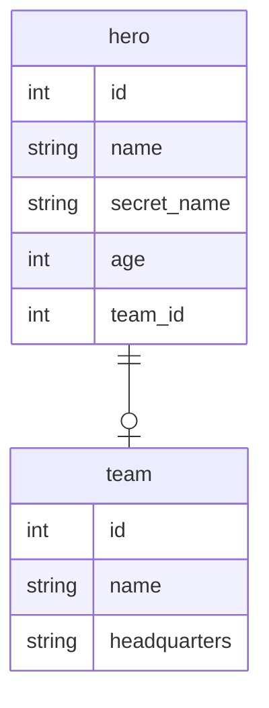

# Entity Relationship Diagram

## Tables

### Team

| Column | Type | Nullable | Primary Key |
|--------|------|----------|-------------|
| id | int | Yes | Yes |
| name | string | No | No |
| headquarters | string | No | No |

### Hero

| Column | Type | Nullable | Primary Key |
|--------|------|----------|-------------|
| id | int | Yes | Yes |
| name | string | No | No |
| secret_name | string | No | No |
| age | int | Yes | No |
| team_id | int | Yes | No |
