# Architecture Guide

## System Architecture

```mermaid
graph LR
    Client["🌐 Client<br/>(Browser/API Client)"]
    FastAPI["⚡ FastAPI<br/>(async web framework)"]
    Models["📋 SQLModel<br/>(ORM + Validation)"]
    Database["💾 Database<br/>(PostgreSQL/SQLite)"]
    Docs["📚 API Docs<br/>(Swagger/ReDoc)"]

    Client -->|HTTP Request| FastAPI
    FastAPI -->|Process| Models
    Models -->|Query/Persist| Database
    FastAPI -->|JSON Response| Client
    Client -->|Browse| Docs

    style FastAPI fill:#3fcf8e
    style Client fill:#4a9eff
    style Database fill:#ff9f5a
    style Models fill:#d084d0
    style Docs fill:#ffd93d
```



## Component Breakdown

### 1. FastAPI Application (`app/main.py`)

**Purpose:** HTTP request handling and routing

**Key Responsibilities:**

- Receive HTTP requests
- Route requests to appropriate handlers
- Return JSON responses
- Manage application lifespan (startup/shutdown)

**Why Async?**

```python
@app.get("/heroes")
async def read_heroes():
    # Async allows handling 1000+ concurrent requests
    # Non-blocking I/O: while waiting for database, handle other requests
    heroes = await db.query(Hero)
    return heroes
```

Benefits:

- **Scalability:** Handle thousands of concurrent connections
- **Performance:** Better CPU utilization during I/O waits
- **Resource Efficiency:** No thread per connection overhead

### 2. SQLModel (`app/classes.py`)

**Purpose:** Data models combining ORM and validation

**Why SQLModel Instead of Alternatives?**

| Tool | ORM | Validation | Pros | Cons |
| ------ | ----- | ----------- | ------ | ------ |
| **SQLModel** | ✅ SQLAlchemy | ✅ Pydantic v2 | Single definition, auto docs | Newer, smaller community |
| **SQLAlchemy ORM** | ✅ | ❌ | Mature, robust | Separate schema definitions |
| **Pydantic ORM** | ❌ | ✅ | Simple validation | No database ORM |
| **Tortoise ORM** | ✅ | ✅ | Async-first | Less integrated |

**Model Structure:**

```python
# Single source of truth for data structure
class Hero(SQLModel, table=True):
    id: int | None = Field(default=None, primary_key=True)
    name: str = Field(index=True)
    secret_name: str
    age: int | None = Field(default=None, index=True)
    team_id: int | None = Field(default=None, foreign_key="team.id")
    team: Team | None = Relationship(back_populates="heroes")

# Automatically serves as:
# - Database table definition
# - Request schema (for creation)
# - Response schema (for API)
# - Validation schema (Pydantic v2)
```

### 3. Database Layer (`app/database.py`)

**Purpose:** Database connection and session management

**Architecture:**

```python
# Connection pooling
engine = create_engine(
    database_url,
    echo=True,  # Log SQL queries
    connect_args={"check_same_thread": False}
)

# Dependency injection for sessions
def get_session() -> Generator[Session, None, None]:
    with Session(engine) as session:
        yield session
```

**Why Dependency Injection?**

- **Testability:** Easy to mock sessions in tests
- **Isolation:** Each request gets its own session
- **Resource Management:** Sessions created and closed properly

### 4. Routers (`app/routers/`)

**Purpose:** Endpoint definitions for each resource

#### Pattern: CRUD Operations

```python
@router.post("/", status_code=201)  # Create
async def create_hero(hero: HeroCreate):
    ...

@router.get("/")  # Read (list)
async def read_heroes():
    ...

@router.get("/{hero_id}")  # Read (single)
async def read_hero(hero_id: int):
    ...

@router.patch("/{hero_id}")  # Update (partial)
async def update_hero(hero_id: int, hero: HeroUpdate):
    ...

@router.delete("/{hero_id}")  # Delete
async def delete_hero(hero_id: int):
    ...
```

## Data Flow

### Request Processing Flow

```text
1. Client sends HTTP request
   ↓
2. FastAPI receives request
   ↓
3. Pydantic validates request body using schema
   ↓
4. Dependency injection provides database session
   ↓
5. Route handler executes business logic
   ↓
6. SQLModel ORM queries/updates database
   ↓
7. SQLAlchemy executes SQL on database
   ↓
8. Results returned to handler
   ↓
9. Pydantic serializes to JSON
   ↓
10. FastAPI returns HTTP response
    ↓
11. Client receives JSON response
```

### Example: Create Hero

```python
# 1. Request arrives
POST /heroes
{
  "name": "Spider-Man",
  "secret_name": "Peter Parker",
  "age": 23
}

# 2. Pydantic validates against HeroCreate schema
class HeroCreate(HeroBase):
    pass  # Inherits name, secret_name, age, team_id (optional)

# 3. Route handler receives validated data
@router.post("/", status_code=201)
async def create_hero(hero: HeroCreate, session: Session = Depends(get_session)):
    # 4. Convert to database model
    db_hero = Hero.model_validate(hero)

    # 5. Add and commit
    session.add(db_hero)
    session.commit()
    session.refresh(db_hero)

    # 6. Return response (auto-serialized by Pydantic)
    return db_hero  # Returns HeroRead schema

# 7. Response sent to client
{
  "id": 1,
  "name": "Spider-Man",
  "secret_name": "Peter Parker",
  "age": 23,
  "team_id": null
}
```

## Database Schema

### Entity Relationship Diagram


### Relationships

#### One-to-Many: Team → Heroes

```python
class Team(SQLModel, table=True):
    heroes: list["Hero"] = Relationship(back_populates="team")

class Hero(SQLModel, table=True):
    team: Team | None = Relationship(back_populates="heroes")
```

**Benefits of Bidirectional Relationships:**

- Access heroes from team: `team.heroes`
- Access team from hero: `hero.team`
- Automatic synchronization

## Modern Design Patterns Used

### 1. Async/Await

```python
# Non-blocking I/O
async def read_heroes():
    heroes = await session.exec(select(Hero))
    return heroes
```

### 2. Dependency Injection

```python
# FastAPI's DI system
def read_heroes(session: Session = Depends(get_session)):
    return session.exec(select(Hero))
```

### 3. Schema Layering

```python
# Request
class HeroCreate(HeroBase):
    pass

# Database
class Hero(HeroBase, table=True):
    id: int | None = Field(default=None, primary_key=True)

# Response
class HeroRead(HeroBase):
    id: int

# Response with relationships
class HeroReadWithTeam(HeroRead):
    team: TeamRead | None = None
```

### 4. Type Hints (Python 3.10+)

```python
# Modern syntax
def process_heroes(heroes: list[Hero]) -> list[HeroRead]:
    return [HeroRead.model_validate(h) for h in heroes]

# Instead of
from typing import List
def process_heroes(heroes: List[Hero]) -> List[HeroRead]:
    ...
```

## Error Handling

### HTTP Status Codes

| Code | Meaning | When Used |
| ------ | --------- | ----------- |
| 200 | OK | Successful GET, PATCH |
| 201 | Created | Successful POST |
| 204 | No Content | Successful DELETE |
| 400 | Bad Request | Malformed request |
| 404 | Not Found | Resource doesn't exist |
| 422 | Validation Error | Invalid data |
| 500 | Server Error | Unexpected error |

### Example Error Response

```python
@router.get("/{hero_id}")
async def read_hero(hero_id: int, session: Session = Depends(get_session)):
    hero = session.get(Hero, hero_id)
    if not hero:
        # 404: Resource not found
        raise HTTPException(
            status_code=status.HTTP_404_NOT_FOUND,
            detail="Hero not found"
        )
    return hero
```

## Testing Architecture

### Test Structure

```python
# In-memory SQLite for tests
@pytest.fixture
def session():
    engine = create_engine(
        "sqlite://",
        connect_args={"check_same_thread": False},
        poolclass=StaticPool
    )
    SQLModel.metadata.create_all(engine)
    with Session(engine) as session:
        yield session

# Override dependencies
@pytest.fixture
def client(session):
    def get_session_override():
        return session

    app.dependency_overrides[get_session] = get_session_override
    return TestClient(app)
```

### Benefits

- **Isolation:** Each test uses fresh database
- **Speed:** In-memory SQLite is fast
- **No Side Effects:** Tests don't affect real database
- **Deterministic:** Same test always produces same result

## Performance Considerations

### Database Optimization

1. **Indexing**

   ```python
   name: str = Field(index=True)  # Fast lookups
   ```

2. **Connection Pooling**

   ```python
   engine = create_engine(
       url,
       pool_size=20,  # Max connections
       max_overflow=10  # Extra connections
   )
   ```

3. **Query Optimization**

   ```python
   # Use pagination
   heroes = session.exec(
       select(Hero).offset(0).limit(10)
   ).all()
   ```

### Async Benefits

1. **Concurrency:** Handle 1000+ concurrent requests with few resources
2. **Efficiency:** Don't block on I/O operations
3. **Scalability:** Linear scaling with CPU cores

### Benchmarks

- **SQLite:** ~1,000 req/s (single-threaded writes)
- **PostgreSQL:** ~10,000 req/s (with async driver)
- **With 4 Gunicorn workers:** ~40,000 req/s

## Scalability Path

### Development (Current)

```text
Browser → FastAPI (1 process) → SQLite
```

### Small Production

```text
nginx → Gunicorn (4 workers) → PostgreSQL
```

### Medium Production

```text
Load Balancer → Gunicorn × N → PostgreSQL + Cache (Redis)
```

### Large Scale

```text
CDN → Load Balancer → Kubernetes Pods → PostgreSQL Cluster + Redis Cluster
```

## Security Architecture

### Built-In Protections

1. **Input Validation**

   ```python
   # Pydantic validates all inputs
   class HeroCreate(HeroBase):
       name: str  # Required, must be string
       age: int | None = None  # Optional, must be int
   ```

2. **SQL Injection Prevention**

   ```python
   # Using ORM prevents SQL injection
   hero = session.get(Hero, hero_id)
   # Instead of:
   # hero = session.exec(f"SELECT * FROM hero WHERE id={hero_id}")
   ```

3. **Type Safety**

   ```python
   # Type hints enable static analysis
   def update_hero(hero_id: int, updates: HeroUpdate):
       # hero_id must be int, updates must match schema
   ```

## See Also

- [Configuration Guide](CONFIGURATION.md)
- [Usage Examples](USAGE_EXAMPLES.md)
- [Production Deployment](PRODUCTION_DEPLOYMENT.md)
