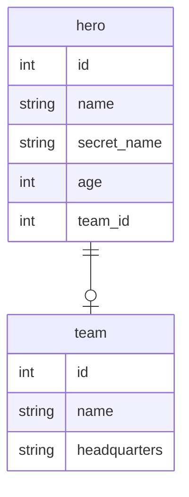

# Database Schema Generator

## Overview

The Schema Generator is an automated tool that converts DBML (Database Markup Language) files into Python SQLModel classes with complete relationship definitions, Mermaid ER diagrams, and comprehensive documentation.

**Location**: `config/generate_schema.py`
**Input**: `config/schema.dbml`
**Outputs**:
- `config/schema.py` - SQLModel class definitions
- `config/schema.md` - Entity Relationship Diagram with table documentation

---

## Table of Contents

1. [Quick Start](#quick-start)
2. [How It Works](#how-it-works)
3. [DBML Syntax](#dbml-syntax)
4. [Generated Output](#generated-output)
5. [Python 3.10+ Features](#python-310-features)
6. [Relationship Handling](#relationship-handling)
7. [Type Mapping](#type-mapping)
8. [Usage Examples](#usage-examples)
9. [Customization](#customization)
10. [Troubleshooting](#troubleshooting)

---

## Quick Start

### Generate Schema from DBML

```bash
# Activate virtual environment
source .venv/bin/activate

# Run the generator
python config/generate_schema.py
```

**Output:**
```
Parsing config/schema.dbml...
Generating Mermaid ER diagram...
Generating SQLModel schema...
✓ Generated config/schema.md
✓ Generated config/schema.py
```

### Use Generated Models

```python
from config.schema import Team, Hero

# Create a team
team = Team(name="Avengers", headquarters="New York")

# Create a hero
hero = Hero(
    name="Tony Stark",
    secret_name="Iron Man",
    age=45,
    team=team
)
```

---

## How It Works

The generator follows a three-stage pipeline:

### Stage 1: DBML Parsing (`parse_dbml`)

Reads the DBML file and extracts:
- Table definitions with column details
- Column attributes (primary key, nullable, indexed)
- Foreign key relationships
- Table constraints

**Key Logic:**
```python
- Reads file line by line
- Identifies table blocks (Table name { ... })
- Parses column definitions: name type [attributes]
- Extracts Ref: statements for relationships
- Builds internal table representation
```

### Stage 2: Schema Generation

#### SQLModel Classes (`generate_sqlmodel_schema`)

Generates Python classes with:
- Field definitions with proper type hints
- Relationship definitions with bidirectional references
- Foreign key constraints
- Primary key definitions

#### Mermaid ER Diagram (`generate_mermaid_er`)

Creates visual entity relationship diagram showing:
- Table structures
- Column types
- Relationship lines between tables
- Column metadata table

### Stage 3: File Output

Writes generated content to:
- `schema.py` - Importable Python module
- `schema.md` - Documentation with embedded diagram

---

## DBML Syntax

### Table Definition

```dbml
Table team {
  id int [pk, increment]
  name string [not null, unique]
  headquarters string [not null]

  indexes {
    name
  }
}
```

### Supported Attributes

| Attribute | Meaning | SQLModel Result |
|-----------|---------|-----------------|
| `pk` | Primary Key | `Field(default=None, primary_key=True)` |
| `increment` | Auto-increment | Part of PK definition |
| `not null` | Required field | Field without `\| None` |
| `unique` | Unique constraint | Database constraint |
| `index` | Indexed column | Database index |

### Relationships

```dbml
Table hero {
  team_id int [ref: > team.id]
}

Ref: hero.team_id > team.id [delete: cascade]
```

**Syntax:**
- `ref: > table.column` - Many-to-one relationship
- `[delete: cascade]` - Cascade delete policy

---

## Generated Output

### SQLModel Classes (schema.py)

**Team Model:**
```python
class Team(SQLModel, table=True):
    """Database model for team table."""

    id: int | None = Field(default=None, primary_key=True)
    name: str
    headquarters: str
    heroes: list["Hero"] = Relationship(back_populates="team")
```

**Hero Model:**
```python
class Hero(SQLModel, table=True):
    """Database model for hero table."""

    id: int | None = Field(default=None, primary_key=True)
    name: str
    secret_name: str
    age: int | None = None
    team_id: int | None = Field(default=None, foreign_key="team.id")
    team: Team | None = Relationship(back_populates="heroes")
```

### Key Features

| Feature | Implementation | Benefit |
|---------|---|---|
| **Bidirectional Relationships** | Forward refs for undefined classes | Navigation in both directions |
| **Foreign Keys** | `Field(foreign_key="table.col")` | Database integrity |
| **Type Safety** | `int \| None` union syntax | Runtime validation |
| **Documentation** | Class docstrings | Self-documenting code |

### Mermaid ER Diagram (schema.md)



**Table:**
| Column | Type | Nullable | Primary Key |
|--------|------|----------|-------------|
| id | int | Yes | Yes |
| name | string | No | No |

---

## Python 3.10+ Features

### Union Type Syntax

The generator produces modern Python 3.10+ syntax:

```python
# ✅ Generated (Modern)
age: int | None = None
team: Team | None = Relationship(...)

# ❌ Old Style (Not Generated)
from typing import Optional
age: Optional[int] = None
team: Optional[Team] = Relationship(...)
```

**Advantages:**
- Cleaner, more readable syntax
- No imports from `typing` module needed
- Aligned with modern Python standards

---

## Relationship Handling

### Bidirectional Relationships

The generator automatically creates bidirectional relationships with proper back_populates:

```python
# Team sees many Heroes
heroes: list["Hero"] = Relationship(back_populates="team")

# Hero sees one Team
team: Team | None = Relationship(back_populates="heroes")
```

### Forward References

Smart handling of class definition order:

```python
# Team → Hero (not yet defined, uses string)
heroes: list["Hero"] = Relationship(...)

# Hero → Team (already defined, uses direct reference)
team: Team | None = Relationship(...)
```

### Automatic Pluralization

The generator intelligently pluralizes relationship field names:

| Table | Field | Rule |
|-------|-------|------|
| `hero` | `heroes` | Standard: add 's' |
| `hero` → ends in 'o' | `heroes` | Add 'es' for 'o' words |
| `category` → ends in 'y' | `categories` | Change 'y' to 'ies' |

---

## Type Mapping

Column types in DBML map to Python types:

| DBML Type | Python Type | SQLAlchemy |
|-----------|---|---|
| `int` | `int` | Integer |
| `string` | `str` | String |
| `text` | `str` | Text |
| `bigint` | `int` | BigInteger |
| `decimal` | `float` | Numeric |
| `float` | `float` | Float |
| `boolean` | `bool` | Boolean |
| `datetime` | `datetime` | DateTime |
| `date` | `date` | Date |
| `time` | `time` | Time |

**Extension Points:**

To add custom types, modify `get_python_type()`:

```python
def get_python_type(dbml_type: str) -> str:
    type_map = {
        # ... existing mappings
        "uuid": "UUID",
        "json": "dict",
    }
    return type_map.get(dbml_type.lower(), "str")
```

---

## Usage Examples

### Example 1: Generate from DBML

```bash
python config/generate_schema.py
```

Produces `config/schema.py` and `config/schema.md`.

### Example 2: Use Generated Models in FastAPI

```python
from fastapi import FastAPI
from sqlmodel import Session, create_engine, SQLModel
from config.schema import Team, Hero

app = FastAPI()
engine = create_engine("sqlite:///database.db")

@app.post("/teams/")
def create_team(team: Team, session: Session) -> Team:
    session.add(team)
    session.commit()
    session.refresh(team)
    return team

@app.get("/teams/{team_id}")
def get_team(team_id: int, session: Session) -> Team:
    team = session.get(Team, team_id)
    return team
```

### Example 3: Update DBML and Regenerate

```bash
# 1. Modify config/schema.dbml
vim config/schema.dbml

# 2. Regenerate
python config/generate_schema.py

# 3. Use new models
from config.schema import NewTable
```

---

## Customization

### Modify Type Mapping

Edit `get_python_type()` function:

```python
def get_python_type(dbml_type: str) -> str:
    type_map = {
        "int": "int",
        "string": "str",
        "uuid": "UUID",  # Custom type
        # Add more mappings...
    }
    return type_map.get(dbml_type.lower(), "str")
```

### Adjust Pluralization Rules

Modify `pluralize()` function:

```python
def pluralize(name: str) -> str:
    if name.endswith("us"):
        return name[:-2] + "i"  # radius → radii
    elif name.endswith("o"):
        return name + "es"
    elif name.endswith("y"):
        return name[:-1] + "ies"
    return name + "s"
```

### Change Output Imports

Modify schema header in `generate_sqlmodel_schema()`:

```python
schema = ('"""...\n'
          'from typing import Annotated\n'  # Add custom imports
          'from sqlmodel import Field, Relationship, SQLModel\n\n\n')
```

### Add Custom Field Attributes

Extend field generation in column loop:

```python
# Add index support
if "index" in col_info["attrs"]:
    default += ", index=True"
```

---

## Troubleshooting

### Issue: "No such file: config/schema.dbml"

**Cause:** DBML file not found.

**Solution:**
```bash
# Verify file exists
ls -la config/schema.dbml

# Create if missing
touch config/schema.dbml
```

### Issue: "NameError: name 'Team' is not defined"

**Cause:** Trying to use generated models before they're created.

**Solution:**
```bash
# Generate schema first
python config/generate_schema.py

# Then import
from config.schema import Team, Hero
```

### Issue: "Foreign key constraint error"

**Cause:** Foreign key references non-existent table.

**Solution:**
Check DBML syntax:
```dbml
# ❌ Wrong: typo in table name
team_id: int [ref: > teem.id]

# ✅ Correct
team_id: int [ref: > team.id]
```

### Issue: Circular imports

**Cause:** Two models referencing each other (rare in generated code).

**Solution:**
Use forward references (string annotations) - generator does this automatically.

### Issue: Generated names don't match app/classes.py

**Cause:** Custom naming conventions in DBML vs production code.

**Solution:**
Use generated schema as reference only, maintain app/classes.py as single source of truth.

---

## Integration with Git

### Commit Generated Files

```bash
git add config/schema.dbml config/schema.py config/schema.md
git commit -m "docs: regenerate schema from updated DBML"
```

### Workflow

```
1. Update config/schema.dbml
   ↓
2. Run python config/generate_schema.py
   ↓
3. Review generated config/schema.py
   ↓
4. Commit all config/* files
   ↓
5. Push to remote
```

---

## Performance Considerations

| Aspect | Notes |
|--------|-------|
| **Parse Time** | <100ms for typical schemas |
| **File Size** | schema.py typically <2KB |
| **Runtime** | No performance impact on application |
| **Memory** | Minimal overhead from relationships |

---

## Architecture Diagram

```
config/schema.dbml
       ↓
   [PARSE]
       ↓
Internal Table Map
       ↓
    ┌──┴──┐
    ↓     ↓
[MERMAID] [SQLMODEL]
    ↓     ↓
  .md    .py
```

---

## Related Documentation

- [SQLModel Documentation](https://sqlmodel.tiangolo.com/)
- [DBML Syntax Guide](https://dbml.dbdiagram.io/docs/)
- [Python Type Hints (PEP 604)](https://peps.python.org/pep-0604/)
- [FastAPI Database Integration](https://fastapi.tiangolo.com/advanced/sql-databases/)

---

## Contributing

To improve the schema generator:

1. **Add type mappings** - Extend `get_python_type()`
2. **Improve pluralization** - Update `pluralize()` function
3. **Parse more DBML** - Enhance `parse_dbml()` for new syntax
4. **Better error handling** - Add validation and messages

---

## License

Part of fastapi-heroes project. See LICENSE file for details.

---

## Support

For issues or questions:

1. Check [Troubleshooting](#troubleshooting) section
2. Review DBML syntax in [DBML Syntax](#dbml-syntax)
3. Compare with [Usage Examples](#usage-examples)
4. Check generator code comments in `config/generate_schema.py`
